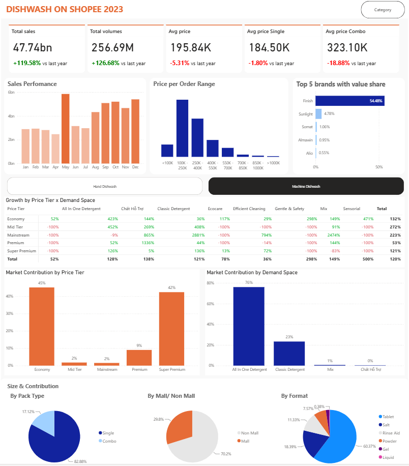
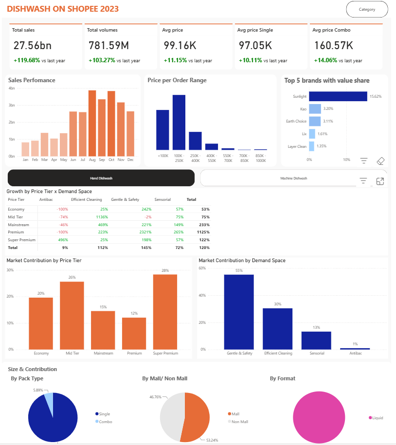
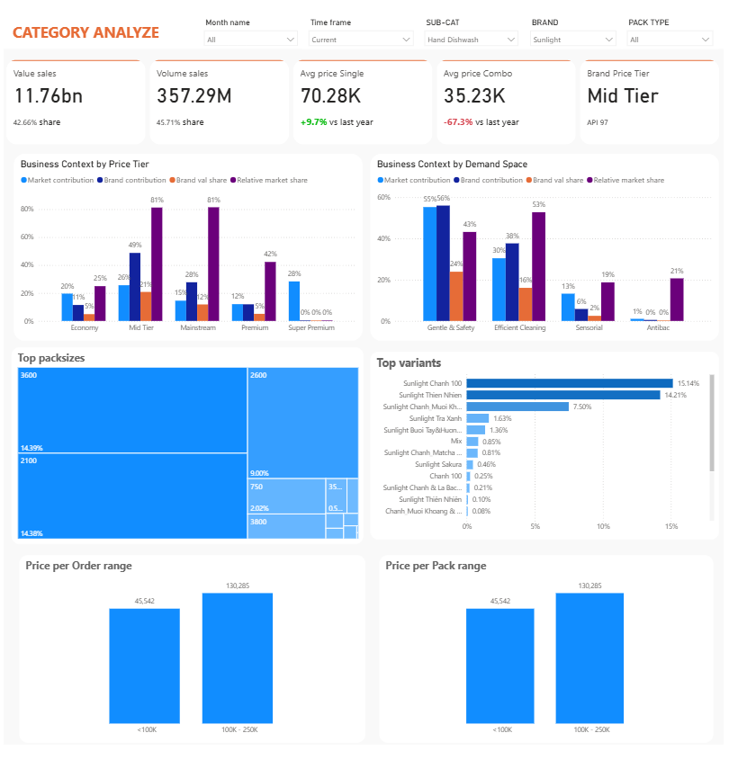
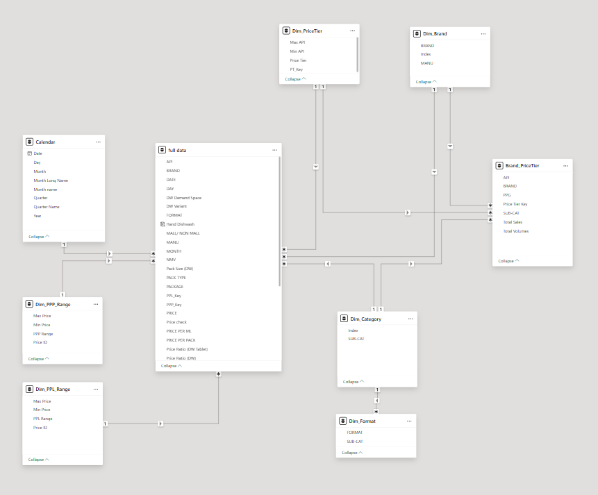

# Dishwash_Shopee
Monitor the dishwashing market on Shopee, and the brand's performance to optimize market share through strategic analysis based on the market context.
# 📊 E-Commerce & Category Performance Dashboard
## 📌 Project Overview & Features

### 1. Project Description & Objectives
This Power BI report serves as a strategic commercial tool for the **Category Management team** to track and analyze the competitive landscape of the E-Commerce Dishwash market. By evaluating key market dynamics, the report empowers stakeholders to refine pricing corridors, optimize product portfolios, and execute data-driven **Category Strategic Planning (CSP)**.

### 2. Key Features & Dashboard Architecture

The report consists of two primary interconnected dashboards, utilizing 2023 dummy data extracted monthly from Shopee via web-scraping techniques:

#### A. The Overview Dashboard
* **Market Mapping:** Visualizes the Dishwash market by cross-analyzing **Demand Space** (assigned based on specific product functional characteristics) and **Price Tier** (defined by the *Average Price Index - API*). This matrix helps identify high-growth segments and white-space opportunities.
* **Core Metrics:** Tracks fundamental commercial KPIs including *Value Sales (NMV)*, *Volume Sales*, and *Average Price* across both Single items and Combo packs.
* **Tailored Filtering:** Includes dedicated filters for **Hand Dishwash** and **Machine Dishwash** to account for the fundamental structural and pricing differences between these two sub-categories.
* **Competitor Benchmarking:** Features a *Sales Performance by Month & Price-per-Order Range* analysis, alongside a *Top 5 Brands by Value Share* tracker to identify and monitor leading competitors.

**
**

#### B. The Category Analysis Dashboard
* **Granular Analytical Filters:** Equipped with 5 dynamic slicers: *Month*, *Time Frame (Current vs. Previous periods via Calculation Groups)*, *Category*, *Brand*, and *Pack Type*.
* **Brand Positioning Tracker:** Enhances standard KPIs with a specialized *Brand Price Tier* metric to decode how competitors are strategically positioning themselves in the market.
* **SKU-Level Deep Dive:** Drill-down capabilities to the exact SKU level, uncovering critical insights regarding standard pack sizes, dominant pack types, and consumer-favorite variants across the market and specific brands.
* **Strategic Application:** Acts as the foundation for portfolio optimization, driving decisions on pack-size architecture, product renovations, or New Product Introductions (NPI).

** 

## 🔀 Data Source
* To explore the data, please follow the instructions below:

### 🔗 Data Access
👉 **[Click here to view the Excel file](Data_Source/Dummy%20Data-DishwashShopee.xlsx)**

## 🔀 Data Cleansing Pipeline via Power Query

The `Data Cleanned` dataset was standardized from the source master dataset (`Raw Pivot`) using Power Query through the following core transformation steps:

### 1. Time Standardization
* **Transformation:** Split the original `MONTH` field (text format, e.g., `2023M06`) into two independent numeric fields: `YEAR` and `MONTH`.
* **Objective:** Synchronize the time structure to seamlessly link with the standard date table (`Dim_Calendar`), optimizing Time Intelligence calculations in DAX.

### 2. Master Data Harmonization
* **Transformation:** * Mapped raw data from the `BRAND (Raw)` field to the standardized `BRAND` field using the brand dimension table (`Dim_Brand`). This corrected all mislabeling issues, missing brand names (such as default `0` values), and typographical errors.
    * Realigned the sub-category structure (`SUB-CAT`) and product physical formats (`FORMAT`) based on the standardized classification table (`Dim_Subcate`).

### 3. Unit & Volume Normalization
* **Transformation:** * Extracted numerical attributes from product titles (`TITLE`) to identify product specifications (`Pack Size (DW)`) and their respective units of measure (`Unit of packsize`, such as *ml, g, Tablet*).
    * Calculated the integrated **Total Volumes** metric (total converted volume/output) to support the tracking of average pricing per volume unit (`PRICE PER ML`).

### 4. Combo Item Unbundling
* **Transformation:** Leveraged data validation flags (`Price check`) and allocation ratios (`Price Ratio (DW)`, `Price Ratio (DW Tablet)`) to accurately unbundle and split net revenue (`NMV`) and volume for complex bundle product codes (e.g., promotional combos containing both single liquid items and dishwasher tablets).

### 5. Feature Engineering for Commercial Insights
* **Transformation:** Created dynamic segment buckets to empower deeper analysis at the point of sale:
    * `API` & `Price Tier`: Categorized products into strategic price segments (Economy, Mid-Tier, Mainstream, Premium, Super Premium).
    * `PPP Range` (Price per Pack Range) & `PPL Range` (Price per Line Range): Grouped product price thresholds to identify optimal packaging architecture.
    * `ULV vs NON ULV`: Tagged competitor benchmarks directly to streamline Market Share and competitive landscape analysis.

## 🔀 Data Transformation & Structuring in Power BI

### 1. Data Modeling & Architecture
* **Price Architecture Dim-Tables:** Developed two standalone dimension tables—`Price Per Pack Range` and `Price Per Line Range`—to facilitate price tiering and segment transactions into strategic price buckets.
* **Fact Table Optimization:** Integrated corresponding Foreign Keys into the primary Fact table to establish robust relationships with dimensions, while trimming redundant columns to optimize model size and query performance.
* **Brand & Price Tier Aggregation:** Extracted data from the master dataset to construct a dedicated `Brand_PriceTier` table for brand positioning analysis.
    * Leveraged the **Group By** transformation to aggregate key metrics across 4 core attributes: *Brand*, *SubCategory*, *Total Sales*, and *Total Volumes*.
    * Engineered a **PPG (Price Per Gram/Unit)** metric to calculate the average price point of each brand per sub-category. This accurately captures market dynamics where Machine Dishwash products naturally command a higher price premium compared to Hand Dishwash due to format specificities.

### 2. Data Model Schema
**

### 3. Key Metrics & Advanced DAX Analytics
* **Dynamic Time Frame via Calculation Groups:** Implemented **Calculation Groups** (via Tabular Editor) to establish a dynamic `Time Frame` entity. This advanced design pattern streamlines DAX measure management, enabling seamless switching between period comparisons—including *Current Month*, *Previous Month*, and *Prior Year (YoY)*—across all dashboard visuals without duplicating formulas.

## 🚀 User Guide & Access

To interact with the live report and explore the data, please follow the instructions below:

### 🔗 Live Dashboard Access
👉 **[Click here to view the Interactive Power BI Dashboard](https://app.powerbi.com/view?r=eyJrIjoiYmM5OGJhMGQtY2NkNi00MmJmLTlmNmQtMjAwNmNhYjgzMTdlIiwidCI6ImNjY2ExZThjLWJkOTUtNGJiYi1hN2Q5LTgzZmM1YjQ1YjI0NCIsImMiOjEwfQ%3D%3D)**

### 📖 How to Use:
1. **No Account Required:** This report is hosted via the **Power BI Publish to Web** feature. You do not need a Power BI Pro or corporate account to access it.
2. **Interactive Filtering:** Simply click on any chart element, slicer, or filter on the left-hand navigation panel. The entire data model and visuals will cross-filter dynamically in real-time.
3. **Tooltips & Drill-Downs:** Hover over data points to unlock pop-up metrics, or right-click on brand/category charts to drill down into specific SKU-level performance.

## 💡 Deep Insights & Strategic Recommendations (Market & Category Analysis)

By cross-analyzing **Price Tiers** against **Demand Spaces**, the following core insights and commercial recommendations have been identified for both sub-categories:

### 1. Hand Dishwash (HDW) Market Insights

* **Market Landscape:** The HDW market is heavily polarized into the **Super Premium** and **Mid-Tier** segments, with **Gentle & Safety** standing out as the dominant consumer demand space.
* **Growth Dynamics:**
    * **Gentle & Safety** is the fastest-growing demand space nationwide, achieving an impressive **+145% YoY growth** across all price buckets. This momentum is strongly shifting toward the **Premium** segment, while the *Mid-Tier* faces a slight 2% contraction. This underscores a clear *Premiumization* trend, where consumers are highly willing to pay a premium for natural, safe, and skin-friendly formulations.
    * On the other hand, the **Efficient Cleaning** (heavy-duty/deep clean) demand space is experiencing robust growth exclusively within the **Mid-Tier** segment.
* **Competitive Landscape:** **Sunlight** maintains absolute market leadership with a **15% value share** in the HDW category, followed by international players **Kao** and **Earth Choice**.
* **🎯 Recommended New Product Introduction (NPI) Strategy:**
    * *Option A (Volume-Driven Strategy):* Introduce an **Efficient Cleaning** product positioned in the **Mid-Tier** to capture scale and mass volume.
    * *Option B (Margin-Driven Strategy):* Launch a **Gentle & Safety** offering positioned in the **Premium / Super Premium** tier to capitalize on the premiumization wave.

### 2. Machine Dishwash (MDW) Market Insights

* **Market Landscape:** The MDW consumer base is highly bifurcated into two distinct pricing extremes: **Budget** and **Premium/Super Premium**.
* **Pricing & Portfolio Dynamics:**
    * The average price of bundled combo packs has dropped significantly by **-20% YoY**, while single packs decreased slightly by **-1%**, indicating that pricing pressure is hitting basic, standard formats.
    * Conversely, the **Premium** and **Super Premium** tiers for high-performance formats—such as *All-in-One Detergents* and *Classic Detergents*—remain highly resilient with strong growth. Machine owners prioritize absolute convenience and high-efficacy benefits.
* **Competitive Landscape:** **Finish** heavily dominates the category with a **54% market share**, successfully controlling both the budget and premium segments. **Sunlight** is positioned as the primary challenger, expanding in the mid-to-high-end tier.
* **🎯 Recommended New Product Introduction (NPI) Strategy:**
    * Develop a premium **Multi-purpose Tablet (All-in-One)** format, launching directly into the **Premium / Super Premium** segment. Marketing should focus on superior, all-inclusive benefits (built-in salt, rinse aid, and detergent) to directly contest Finish's dominance.

### 3. Competitor Portfolio & SKU Deep-Dive (Category Analysis)

The **Category Analysis** dashboard page enables the brand team to dissect any competitor's commercial playbook to build a direct counter-strategy. 

* **Case Study - Sunlight (Market Leader Analysis):**
    * **Share & Investment Concentration:** Sunlight holds a **42.6% value share** within tracked digital channels. Its core volume is anchored in the **Mid-Tier** segment (accounting for 21% of the total market and making up **81% of Sunlight's internal sales volume**). This is clearly Sunlight’s most heavily defended price tier in terms of Trade Marketing investment.
    * **Portfolio Architecture:** * *Core Product (Volume Driver):* **Sunlight Lemon 100**.
        * *Added-Value Product (Margin Driver):* **Sunlight Natural (Thiên Nhiên)**.
    * **Pack-size Architecture & Price Corridor:** Heavily concentrated in large-format bags/bottles—specifically **2100ml** and **3600ml**—with retail prices ranging from **100,000 to 250,000 VND**.
* **💡 Commercial Application:** By leveraging the dashboard filters for specific competitors, category managers can immediately identify a rival's **Hero SKUs**, expose price gaps (*White Spaces*), and benchmark packaging sizes to optimize promotional calendars and pack-size configurations.
